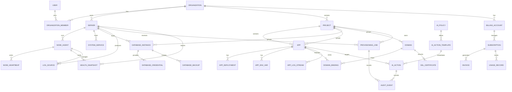

# Razad
## Entity Relationship Diagram (ERD) v1.0

**Product Name:** Razad  
**Document Version:** 1.0  
**Status:** Draft  
**Scope:** Self-hosted OSS, Razad Cloud BYO VPS, Razad Managed Infrastructure  
**Primary Purpose:** Define the core domain model for product, cloud, and execution-layer data.

---

## 1. Purpose

This document defines the core entities, attributes, relationships, and cardinalities required for Razad. The goal is to establish a stable domain model before database schema implementation so the product can scale from self-hosted installs to cloud-managed infrastructure without repeated structural rewrites.

---

## 2. Modeling Principles

1. **Tenant-aware by design** — every owned resource belongs to a clear scope.
2. **Control plane / execution plane separation** — cloud metadata and node-local operational state are not the same thing.
3. **Auditability first** — privileged actions must be recorded.
4. **Composable entities** — apps, domains, databases, and nodes should be independently manageable.
5. **Extensible without breaking changes** — the model should leave room for future scheduling, backups, billing, and fleet management.

---

## 3. Core Domain Areas

Razad’s data model is grouped into these areas:

- Identity and tenancy
- Infrastructure and nodes
- Applications and deployments
- Domains and SSL
- Databases and credentials
- Logs and metrics
- AI operations and policy actions
- Billing and provisioning (cloud mode)
- Audit and event history

---

## 4. ERD Overview

---

## 5. Entity Definitions

## 5.1 USER

Represents an authenticated human account.

**Primary purpose**
- Login identity
- Ownership and delegation entry point
- Audit actor reference

**Key attributes**
- `id`
- `name`
- `email`
- `password_hash`
- `status`
- `created_at`
- `updated_at`

---

## 5.2 ORGANIZATION

Represents a tenancy boundary.

**Primary purpose**
- Scope for users, servers, projects, billing, and cloud resources

**Key attributes**
- `id`
- `name`
- `slug`
- `plan_type`
- `status`
- `created_at`
- `updated_at`

---

## 5.3 ORGANIZATION_MEMBER

Join table between users and organizations.

**Primary purpose**
- Support multi-user access within an organization
- Track role and membership status

**Key attributes**
- `id`
- `organization_id`
- `user_id`
- `role`
- `status`
- `created_at`

**Typical roles**
- owner
- admin
- operator
- viewer

---

## 5.4 PROJECT

Logical grouping for resources inside an organization.

**Primary purpose**
- Group apps, databases, domains, and provisioning jobs by product or client scope

**Key attributes**
- `id`
- `organization_id`
- `name`
- `slug`
- `description`
- `status`
- `created_at`
- `updated_at`

---

## 5.5 SERVER

Represents a node managed by Razad.

This may be:
- a customer-owned VPS in BYO mode,
- a self-hosted machine,
- or a Razad-managed infrastructure node.

**Primary purpose**
- Host execution workloads and node-local services

**Key attributes**
- `id`
- `organization_id`
- `project_id` (nullable)
- `name`
- `provider_type`
- `mode` (`self_hosted`, `byo_vps`, `managed`)
- `region`
- `hostname`
- `ip_address`
- `status`
- `last_seen_at`
- `created_at`
- `updated_at`

---

## 5.6 NODE_AGENT

Represents the agent process installed on a server.

**Primary purpose**
- Secure local execution endpoint
- Heartbeat and health reporting
- Action execution on the node

**Key attributes**
- `id`
- `server_id`
- `agent_version`
- `enrolled_at`
- `last_heartbeat_at`
- `status`
- `public_key_fingerprint`
- `created_at`
- `updated_at`

---

## 5.7 APP

Represents a managed application.

**Primary purpose**
- Store deployment metadata, runtime, and lifecycle state

**Key attributes**
- `id`
- `organization_id`
- `project_id`
- `server_id`
- `name`
- `slug`
- `source_type` (`git`, `upload`)
- `repository_url` (nullable)
- `runtime`
- `start_command`
- `working_directory`
- `status`
- `created_at`
- `updated_at`

---

## 5.8 APP_DEPLOYMENT

Represents a deployment instance or revision for an app.

**Primary purpose**
- Track app version history and rollout attempts

**Key attributes**
- `id`
- `app_id`
- `revision`
- `source_ref`
- `deploy_status`
- `started_at`
- `finished_at`
- `deployed_by_user_id` (nullable)
- `deployed_by_ai_action_id` (nullable)
- `created_at`

---

## 5.9 APP_ENV_VAR

Represents an encrypted environment variable attached to an app.

**Primary purpose**
- Secure runtime configuration storage

**Key attributes**
- `id`
- `app_id`
- `key`
- `value_encrypted`
- `is_secret`
- `created_at`
- `updated_at`

---

## 5.10 DOMAIN

Represents a domain owned or managed inside the platform.

**Primary purpose**
- Store domain ownership, binding, and certificate state

**Key attributes**
- `id`
- `organization_id`
- `project_id`
- `name`
- `status`
- `dns_verified_at`
- `created_at`
- `updated_at`

---

## 5.11 DOMAIN_BINDING

Represents the mapping between an app and a domain.

**Primary purpose**
- Bind routing and public exposure to a workload

**Key attributes**
- `id`
- `app_id`
- `domain_id`
- `path_prefix` (nullable)
- `proxy_mode`
- `status`
- `created_at`
- `updated_at`

---

## 5.12 SSL_CERTIFICATE

Represents certificate lifecycle state for a domain.

**Primary purpose**
- Track issuance, expiry, and renewal status

**Key attributes**
- `id`
- `domain_id`
- `issuer`
- `common_name`
- `certificate_path`
- `key_path`
- `expires_at`
- `status`
- `last_issued_at`
- `created_at`
- `updated_at`

---

## 5.13 DATABASE_INSTANCE

Represents a database service managed by Razad.

**Primary purpose**
- Store service metadata for MySQL, PostgreSQL, or Redis

**Key attributes**
- `id`
- `organization_id`
- `project_id`
- `server_id`
- `name`
- `engine`
- `version`
- `status`
- `port`
- `data_directory`
- `created_at`
- `updated_at`

---

## 5.14 DATABASE_CREDENTIAL

Represents credentials for a database instance.

**Primary purpose**
- Secure access control for managed databases

**Key attributes**
- `id`
- `database_instance_id`
- `username`
- `password_encrypted`
- `host`
- `created_at`
- `updated_at`

---

## 5.15 DATABASE_BACKUP

Represents a manual or later scheduled backup artifact.

**Primary purpose**
- Backup tracking and restore planning

**Key attributes**
- `id`
- `database_instance_id`
- `backup_type`
- `storage_location`
- `status`
- `created_at`
- `completed_at`

---

## 5.16 LOG_SOURCE

Represents a local source of logs on a node.

**Primary purpose**
- Normalize logs by source type

**Key attributes**
- `id`
- `server_id`
- `source_type` (`app`, `systemd`, `nginx`, `database`, `audit`)
- `source_ref_id`
- `status`
- `created_at`
- `updated_at`

---

## 5.17 APP_LOG_STREAM

Represents a live or persisted log stream for an app.

**Primary purpose**
- Support UI log streaming and filtering

**Key attributes**
- `id`
- `app_id`
- `cursor`
- `last_event_at`
- `created_at`
- `updated_at`

---

## 5.18 HEALTH_SNAPSHOT

Represents a captured node health state.

**Primary purpose**
- Store metrics and health data for observability and AI analysis

**Key attributes**
- `id`
- `server_id`
- `cpu_usage`
- `memory_usage`
- `disk_usage`
- `load_average`
- `status`
- `captured_at`

---

## 5.19 NODE_HEARTBEAT

Represents periodic liveness signal from a node agent.

**Primary purpose**
- Determine online/offline state

**Key attributes**
- `id`
- `node_agent_id`
- `status`
- `sent_at`
- `rtt_ms` (nullable)

---

## 5.20 AI_POLICY

Represents a policy profile that defines which AI behaviors are allowed.

**Primary purpose**
- Safety boundary for AI actions

**Key attributes**
- `id`
- `organization_id` (nullable for global defaults)
- `name`
- `mode`
- `is_active`
- `created_at`
- `updated_at`

---

## 5.21 AI_ACTION_TEMPLATE

Represents a reusable allowed AI action definition.

**Primary purpose**
- Whitelist registry for AI execution

**Key attributes**
- `id`
- `ai_policy_id`
- `action_key`
- `scope`
- `is_allowed`
- `created_at`
- `updated_at`

---

## 5.22 AI_ACTION

Represents one AI-initiated or AI-suggested action.

**Primary purpose**
- Track AI decisions, requests, approvals, execution, and outcomes

**Key attributes**
- `id`
- `organization_id`
- `server_id` (nullable)
- `app_id` (nullable)
- `action_key`
- `action_status`
- `requested_by_user_id` (nullable)
- `executed_by_node_agent_id` (nullable)
- `approved_at` (nullable)
- `executed_at` (nullable)
- `result_summary`
- `created_at`
- `updated_at`

---

## 5.23 AUDIT_EVENT

Represents an immutable record of significant platform activity.

**Primary purpose**
- Compliance, debugging, and trust

**Key attributes**
- `id`
- `organization_id`
- `actor_type`
- `actor_id` (nullable)
- `event_type`
- `subject_type`
- `subject_id` (nullable)
- `payload_json`
- `created_at`

---

## 5.24 BILLING_ACCOUNT

Represents billing identity for an organization.

**Primary purpose**
- Subscription and invoice ownership

**Key attributes**
- `id`
- `organization_id`
- `billing_email`
- `billing_name`
- `billing_status`
- `created_at`
- `updated_at`

---

## 5.25 SUBSCRIPTION

Represents active or historical paid plan state.

**Primary purpose**
- Track plan, limits, and renewal status

**Key attributes**
- `id`
- `billing_account_id`
- `plan_name`
- `status`
- `billing_cycle`
- `renewal_at`
- `created_at`
- `updated_at`

---

## 5.26 INVOICE

Represents a billing invoice.

**Primary purpose**
- Charge tracking and financial history

**Key attributes**
- `id`
- `subscription_id`
- `invoice_number`
- `amount`
- `currency`
- `status`
- `issued_at`
- `paid_at` (nullable)

---

## 5.27 USAGE_RECORD

Represents billable usage or resource consumption.

**Primary purpose**
- Metering and plan enforcement

**Key attributes**
- `id`
- `subscription_id`
- `metric_key`
- `quantity`
- `measured_at`
- `created_at`

---

## 5.28 PROVISIONING_JOB

Represents a cloud-side provisioning or orchestration task.

**Primary purpose**
- Track infrastructure lifecycle tasks and their outcomes

**Key attributes**
- `id`
- `organization_id`
- `project_id`
- `server_id` (nullable)
- `job_type`
- `job_status`
- `provider_type`
- `requested_by_user_id` (nullable)
- `started_at` (nullable)
- `finished_at` (nullable)
- `created_at`

---

## 6. Relationship Rules

## 6.1 Tenancy

- One **Organization** has many **Users** through **OrganizationMember**.
- One **Organization** has many **Projects**.
- One **Organization** has many **Servers**.
- One **Organization** has many **BillingAccounts** in cloud mode, usually one primary account.

## 6.2 Resource Ownership

- One **Project** owns many **Apps**, **Domains**, **DatabaseInstances**, and **ProvisioningJobs**.
- One **Server** hosts many **Apps**, **DatabaseInstances**, **NodeAgents**, and **HealthSnapshots**.

## 6.3 App Dependencies

- One **App** can have many **AppDeployments**.
- One **App** can have many **AppEnvVars**.
- One **App** can have many **DomainBindings**.
- One **App** can have one or more **AppLogStreams**.

## 6.4 Domain Dependencies

- One **Domain** can be bound to many **Apps** over time, but a single active binding should be enforced per route scope.
- One **Domain** can have one current **SSLCertificate** record, with history handled later if needed.

## 6.5 Database Dependencies

- One **DatabaseInstance** has one or more **DatabaseCredentials**.
- One **DatabaseInstance** has many **DatabaseBackups**.

## 6.6 AI and Audit Dependencies

- One **AIAction** may target one app or one server, depending on action type.
- Every **AIAction** should produce at least one **AuditEvent**.
- Every **ProvisioningJob** should produce at least one **AuditEvent**.

---

## 7. Cardinality Notes

### 7.1 One-to-Many

Typical one-to-many relationships:
- Organization → Projects
- Project → Apps
- App → Deployments
- Server → Apps
- App → Env Vars
- DatabaseInstance → Backups
- NodeAgent → Heartbeats

### 7.2 Many-to-Many

Many-to-many relationships should be normalized through join tables:
- Users ↔ Organizations via OrganizationMember
- Apps ↔ Domains via DomainBinding when route rules require flexible mapping

### 7.3 Optional Foreign Keys

Some relationships are optional to support future workflows:
- `project_id` on Server
- `server_id` on AIAction
- `app_id` on AIAction
- `deployed_by_user_id` and `deployed_by_ai_action_id` on AppDeployment

---

## 8. Data Integrity Rules

1. Every application must belong to one tenant scope.
2. Every privileged action must be auditable.
3. Secret values must not be stored in plaintext.
4. A server in managed or BYO mode must have exactly one enrolled agent record in normal operation.
5. A database credential must never be exposed in API responses after creation.
6. A deleted entity should generally be soft-deleted unless operationally unsafe.
7. AI actions must be validated against the policy registry before execution.

---

## 9. Soft Delete Policy

Recommended entities for soft delete:
- User
- Organization
- Project
- Server
- App
- Domain
- DatabaseInstance
- AIAction
- BillingAccount

Recommended entities for hard retention or immutable history:
- AuditEvent
- UsageRecord
- Invoice
- NodeHeartbeat

---

## 10. Suggested Indexes

These indexes should exist in the first implementation:

- `users.email` unique
- `organization_members.organization_id, user_id` unique
- `projects.organization_id, slug` unique
- `servers.organization_id, hostname` unique where appropriate
- `apps.project_id, slug` unique
- `domain_bindings.domain_id, app_id` unique or scoped unique
- `app_env_vars.app_id, key` unique
- `database_instances.server_id, name` unique
- `ai_actions.organization_id, created_at`
- `audit_events.organization_id, created_at`
- `node_heartbeats.node_agent_id, sent_at`

---

## 11. Recommended Schema Split

For implementation, the data model should be logically split into these schema groups:

- `identity`
- `organization`
- `infrastructure`
- `application`
- `networking`
- `database`
- `observability`
- `ai`
- `billing`
- `audit`
- `provisioning`

This split helps keep migrations understandable and keeps control-plane concepts separate from execution-plane state.

---

## 12. Entity Priority for MVP

The minimum viable set for first implementation should be:

- User
- Organization
- OrganizationMember
- Project
- Server
- NodeAgent
- App
- AppDeployment
- AppEnvVar
- Domain
- DomainBinding
- SSLCertificate
- DatabaseInstance
- DatabaseCredential
- AuditEvent
- AIAction
- AIPolicy
- AIActionTemplate
- HealthSnapshot
- NodeHeartbeat

Billing entities can be stubbed or delayed if managed infrastructure is not yet activated.

---

## 13. Implementation Notes

- Use UUIDs or comparable non-sequential identifiers for externally visible entities.
- Keep secrets encrypted at rest.
- Preserve historical audit records even when the referenced subject is deleted.
- Avoid hard coupling between cloud billing and execution-plane records.
- Keep AI policies data-driven rather than hardcoded wherever practical.

---

## 14. Closing Statement

This ERD is intentionally broad enough to support the product’s three operating modes, but narrow enough to keep the first release implementable.

The model’s central idea is simple:

**tenancy owns resources, servers host execution, apps expose workloads, and every privileged action leaves an audit trail.**

